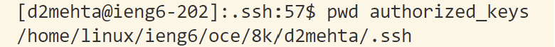

# **<u> Lab Report 2 </u>**
## **Part 1**
### `Code for ChatServer` ###
```java
import java.io.IOException;
import java.net.URI;
import java.util.ArrayList;


class Handler implements URLHandler {
    // The one bit of state on the server: a number that will be manipulated by
    // various requests.
    ArrayList <String> cMess = new ArrayList<>();

    public String handleRequest(URI url) {
        if (url.getPath().contains("/add-message")) {
            String[] parameters = url.getQuery().split("=");
            String[] message = parameters[1].split("&");
            cMess.add(String.format("%s: %s", parameters[2],message[0] ));
            
        }
        return this.write();
    }

    private String write(){
        String allLines = "";
        for(String line: cMess){
            allLines+=(line+ "\n");
        }
        return allLines;
    }
}

class ChatServer {
    public static void main(String[] args) throws IOException {
        if(args.length == 0){
            System.out.println("Missing port number! Try any number between 1024 to 49151");
            return;
        }

        int port = Integer.parseInt(args[0]);

        Server.start(port, new Handler());
    }
}
``` 
<br> 

#### General process before adding messages to `URI` ####
When the command `java ChatServer 4000` is run. The main method of the `class ChatServer` is run which calls the `method start` with the arguments `port` and `new handler()`from the `class Server`. `port` is an integer value storing the port number passed as a command line argument through the terminal while `new Handler()` has been used to create anew object of the `class handler` to perform the function of adding messages to the `server`. This creates a new `server` with that `port` number. 

<br>

**1. Screenshot 1:** \
When I add `/add-message?s=Hello&user=jpolitz` to the `URI`, the `method handle` of the `class ServerHttpHandler` is run with the argument `final HttpExchange exchange`. This method calls the `method handleRequest` with the argument `URI url` which receives the part of the `URI` after the `Domain`. This method stores every successive message passed to it in the field `Arraylist<String> cMess`. After storing the message, the `method write` is called which returns a single `String` storing all the messages, in this case only `jpolitz: Hello`. Following this `handleRequest`, returns this `String` with all the messages. \
*No arguments are changed by any of the methods. They are only changed when the URI of the server is altered. However, the value of the field `cMess` is modified.*\
 

**2. Screenshot 2:** \
When I add `/add-message?s=How are you&user=yash` to the `URI`, the `method handle` of the `class ServerHttpHandler` is run with the argument `final HttpExchange exchange`. This method calls the `method handleRequest` with the argument `URI url` which receives the part of the `URI` after the `Domain`. This method stores every successive message passed to it in the field `Arraylist<String> cMess`. `cMess` stores this message at the 1st index of this `ArrayList` since index 0 has already been occupied. After storing the message, the `method write` is called which returns a single `String` storing both the messages, in this case `jpolitz: Hello` and `yash: How are you` on different lines. Following this `handleRequest`, returns this `String` with both the messages. \
*No arguments are changed by any of the methods. They are only changed when the URI of the server is altered. However, the value of the field `cMess` is modified.*\


<br>

## **Part 2**


**1. Absolute Path to the *Private Key*:** `C:\Users\Devashish\.ssh\id_rsa`


**2. Absolute Path to the *Public Key*:** `C:\Users\Devashish\.ssh\id_rsa.pub` 


**3. Logging into `ieng6`:** \

<br>

## **Part 3**
Weeks 2 and 3 were extremely enriching. I had no idea of many of the commands, like`ssh`, `scp`, `mkdir`, etc., and absolutely no knowledge of how servers worked prior to these weeks. I have not only expanded my understanding of these but also learned the right approach to testing and debugging.
