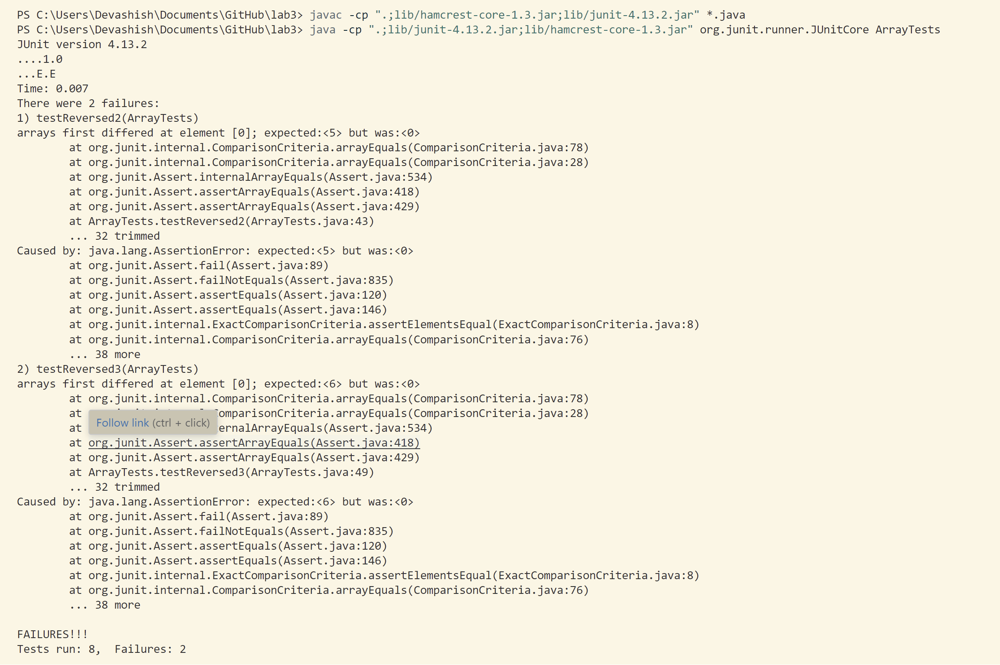
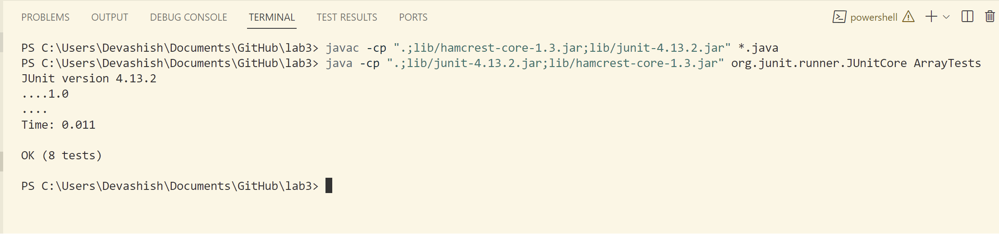
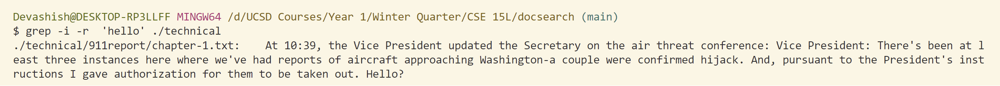
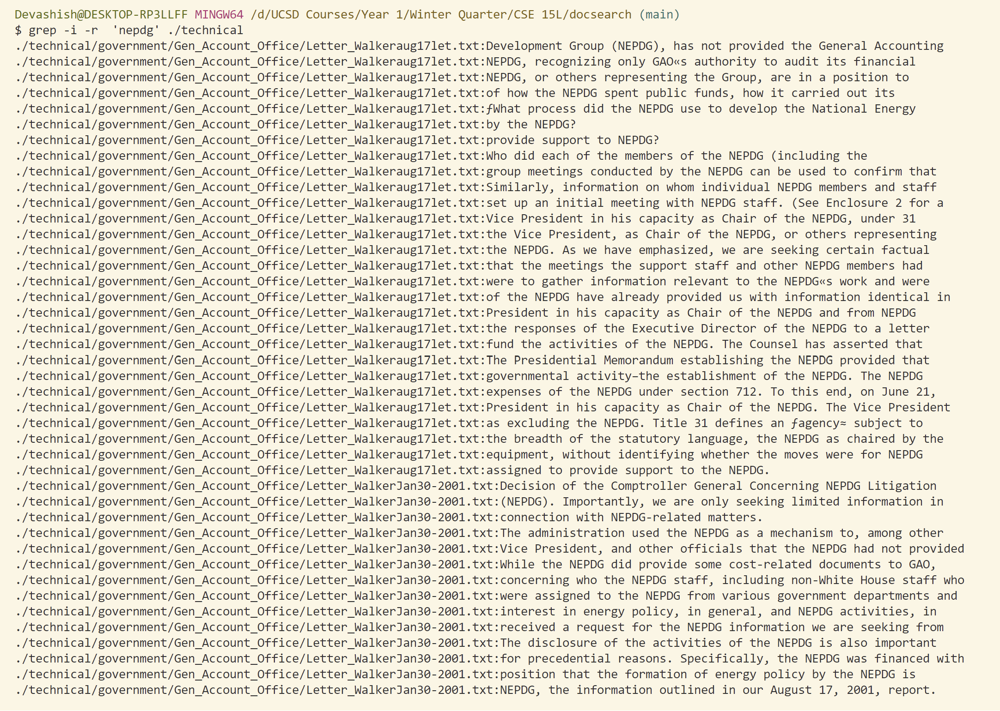
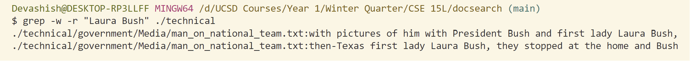
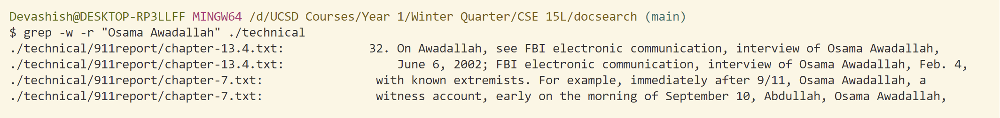
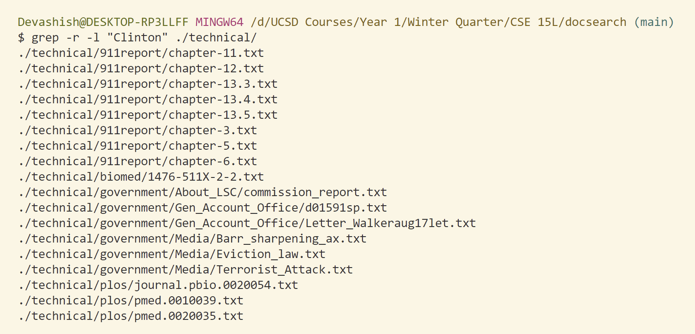
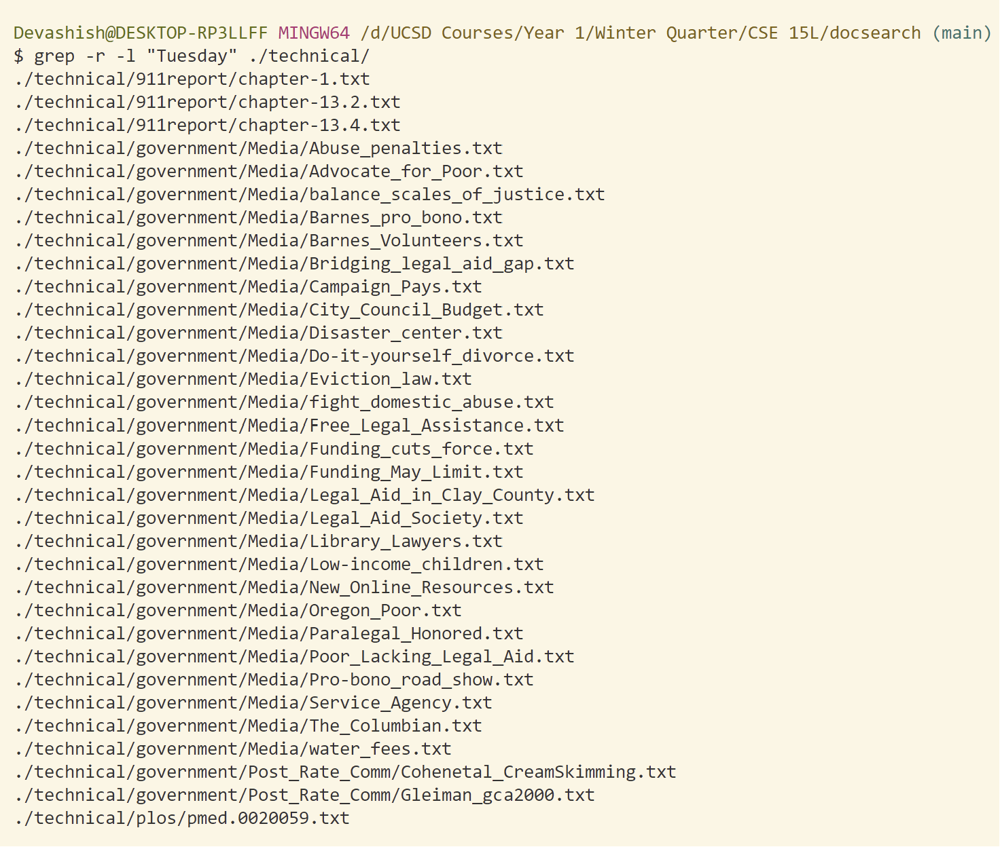
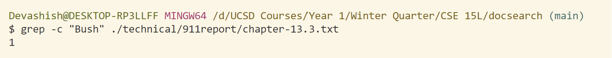
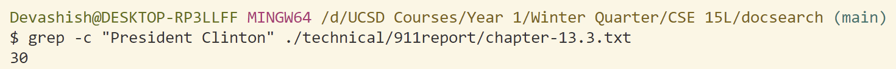

# <u> **Lab Report 3** </u> 
## **Part 1-Bugs**
* `Failure Inducing Input`
```java
  @Test
  public void testReversed2() {
    int[] input1 = {1,2,3,4,5 };
    assertArrayEquals(new int[]{5,4,3,2,1 }, ArrayExamples.reversed(input1));
  }
```
* `Working Input`
```java
  @Test
  public void testReversed() {
    int[] input1 = { };
    assertArrayEquals(new int[]{ }, ArrayExamples.reversed(input1));
  }
```  

* `Symptom`
 

* `Code with the Error`
```java
  static int[] reversed(int[] arr) {
    int[] newArray = new int[arr.length];
    for(int i = 0; i < arr.length; i += 1) {
      arr[i] = newArray[arr.length - i - 1];
    }
    return arr;
  }
```  
* `Fixed Code`
```java
  static int[] reversed(int[] arr) {
    int[] newArray = new int[arr.length];
    for(int i = 0; i < arr.length; i += 1) {
      newArray[i] = arr[arr.length - i - 1];
    }
    return newArray;
  }
```
* `Explaining the Error and Fix` \
In the incorrect code, the array `newArray` is being used to change the values in the array parameter `arr` with the default values 0 in `newArray`. After the loop runs every element in `arr` would be 0. The function returns this array `arr`. \
In the correct code, the array `newArray` is initialized with the elements of the array `arr` in reverse order. The `ith` index in `newArray` is the `n-1-ith` index in `arr`. 

* `Output after fixing the Code`


## **Part 2 - Researching Commands**
### `Command grep`
The `--help` command described the `grep` command as a command used to *Search for PATTERN in each FILE or standard input. PATTERN is, by default, a basic regular expression (BRE).*
Example: grep -i 'hello world' menu.h main.c

<br>

**1. Command Line Option `-i`:** \
The command line option `-i` makes `grep` ignore case distinctions while searching for the String in the files. Using it with `-r` command line option enables `grep` to look for the String in the files in any given directory. \
 
 

**2. Command Line Option `-w`:** \
The command line option `-w` makes `grep` force PATTERN(String passed as command line argument) to match only whole words in the file. Using it with `-r` command line option enables `grep` to look for the pattern in the files in any given directory. \
 
 

**3. Command Line Option `-l`:** \
The command line option `-l` makes `grep` print only names (relative paths) of FILEs containing matches(String passed as command line argument in the files passed). Using it with `-r` command line option enables `grep` to look for the String in the files in any given directory. \
 
 

**4. Command Line Option `-c`:** \
The command line option `-c` makes `grep`  print only a count of matching lines per FILE(number of lines in which the String passed as command line argument is in the file). \
 
 


### **Sources Used**
`--help` command in Git Bash for obtaining the description of the commands. 
