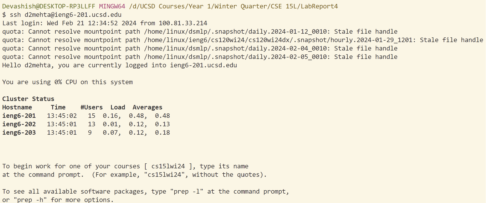
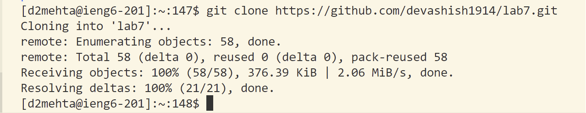
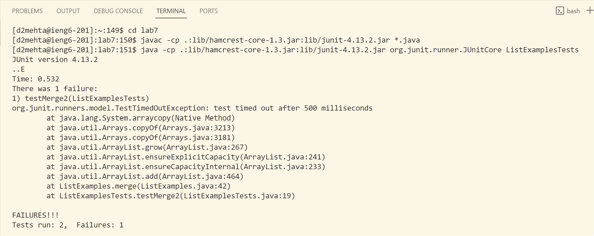
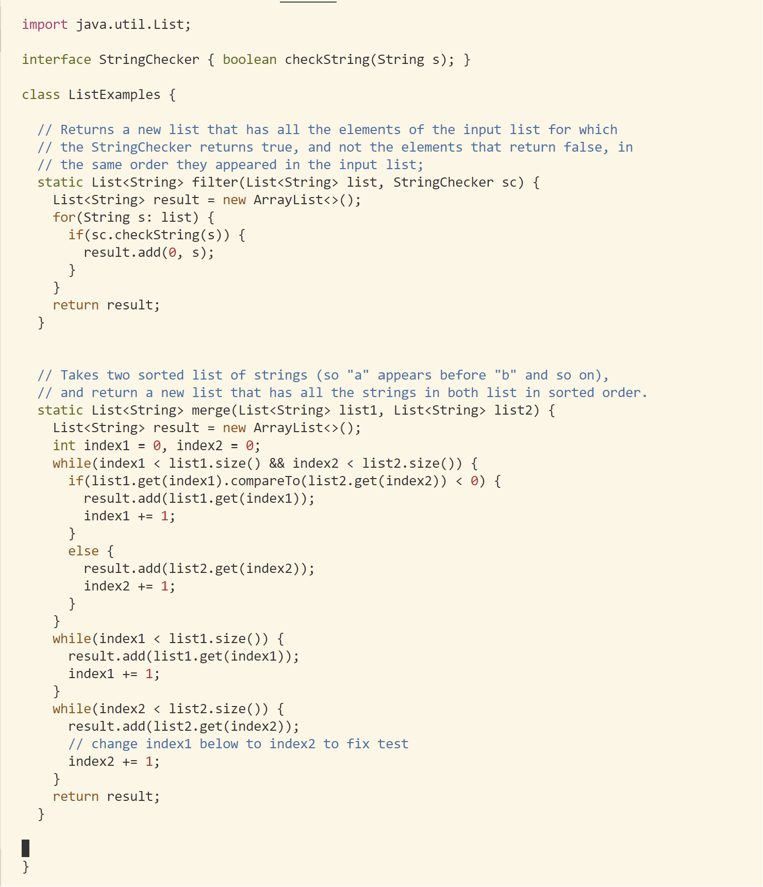
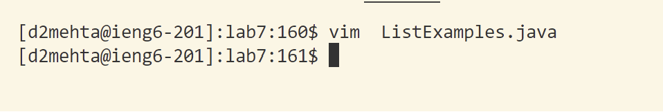
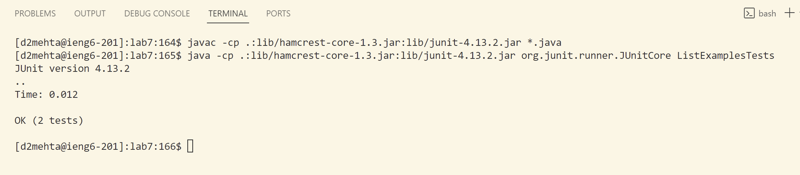
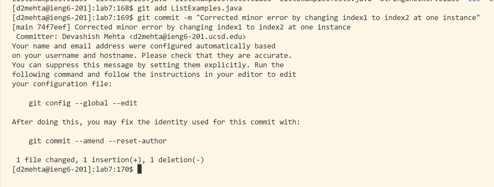
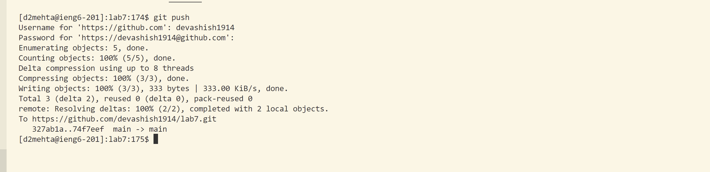

# **<u> Lab Report 4 </u>**
## **VIM- Week 7**

**1. Step 4 - Logging into ieng6:** \
Keys pressed: `<up><up><enter>` The `ssh d2mehta@ieng6-201.ucsd.edu` was 2 up in the search history, so I used an up arrow to access it and log in.  \
 

**2. Step 5 - Cloning from my GitHub Account::** \
Keys pressed: I typed `git clone`, copied the url of the fork from github by pressing `<Ctrl+C>`and completed the command by pressing`<Ctrl+V>``<Enter>`.   \

**3. Step 6 - Runnning the tests which fail:** \
Keys pressed:`cd lab7` `<enter>`,`<up><up><up><up><up><up><up><up><up><up><enter>`,`<up><up><up><up><up><up><up><up><up><up><enter>`. I entered the `lab7` directory. The `javac -cp .:lib/hamcrest-core-1.3.jar:lib/junit-4.13.2.jar *.java` was 10 up in the search history, so I used an up arrow to access it and compile the tests. Then the `java -cp .:lib/hamcrest-core-1.3.jar:lib/junit-4.13.2.jar org.junit.runner.JUnitCore ListExamplesTests` was 10 up in the history, so I accessed and ran it in the same way.  \
 

**4. Step 7 - Editing the code and fixing the test:** \
Keys pressed: `vim ListExamples.java` `<enter>` `e` `index1` `<enter>` `n` `n` `n` `n` `n` `n` `n` `n` `n` `<rightarrow>` `<rightarrow>` `<rightarrow>` `<rightarrow>` `<rightarrow>` `c` `e` `2` `<Space>` `+` `=` `<esc>` `:wq` I entered the file using the `vim` command and then searched for `index1` in the file, found the point in the program where the error was and corrected it by changing it to `index2` where it was needed. \
 
 

**5. Step 8 - Running the Code after it was fixed:** \
Keys pressed: `<up><up><up><up><up><up><up><up><up><up><up><up><up><up><enter>` `<up><up><up><up><up><up><up><up><up><up><up><up><up><up><enter>`. The `javac -cp .:lib/hamcrest-core-1.3.jar:lib/junit-4.13.2.jar *.java` was 14 up in the search history, so I used an up arrow to access it and compile the tests. Then the `java -cp .:lib/hamcrest-core-1.3.jar:lib/junit-4.13.2.jar org.junit.runner.JUnitCore ListExamplesTests` was 14 up in the history, so I accessed and ran it in the same way. \
 

**6. Step 9 - Committing and pushing the resulting change to my Github account** \
Keys pressed:
`git add ListExamples.java ` `<enter>` `git commit -m "Corrected minor error by changing index1 to index2 at one instance"` `<enter>`  `git push` `<enter>` `devashish1914` `<enter>` `Ctrl-C` `<Ctrl-V>` `<enter>`. Adding, committing and pushing the file to GitHub. For pushing the file I copied my personal access token and pasted it when ther terminal asked for the password. \
 
 

