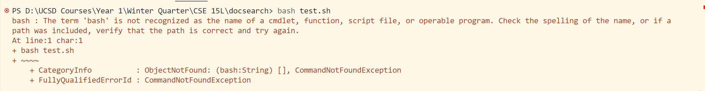

# **<u> Lab Report 5 </u>**
## **Part 1: Debugging Scenario**

**1. Post from Student:** \
Dear Sir/Ma'am, \
I have written some tests for my file `DocSearchServer.java` in the file `TestDocSearch.java`, but for some reason they are not getting executed with the `bash test.sh` command. I would be eternally grateful if you could help me locate the bug and fix the problem. \
Thanking you. \
Yours sincerely, \
Devashish Mehta.  \
 

**2. Response from a TA** \
Hi Devashish, it seems that you are running this command in `powershell`. To make this work, you should run it `git bash` since the `bash` command does not work in `powershell`. If that still does not work please share your `test.sh` file with us so that we can see if that has an error.  

**3. The state of the student after adhering to the TA's advice:** \
After executing the same command in `git bash`, it worked. All the tests passed. There was no bug in the code. The `bug` was there in my execution. I was executing a `.sh` file using the `bash` command in `powershell` instead of `git bash` where it would have worked. \
 

**4. Information about the setup:** 
- *File and Directory Structure* \
The working directory: `docsearch` \
Absoulute Path of `test.sh`: `/d/UCSD Courses/Year 1/Winter Quarter/CSE 15L/docsearch/test.sh`
 
- *Content of File before fixing the Bug* \
The content of the file remains the same even after I fix the bug since the bug was not in my file or bash script, but in the manner in which I executed the file in the terminal. 

- *Command I ran to triger the bug* \
Running `bash test.sh` in `powershell` made me encounter that error. 
 
- *Fixing the bug* \
As soon as I ran the same command in `git bash`, the error went away. This caused the symptom to go away and the correct output to be displayed in the terminal. I only needed to edit where I was running the command to fix the error.i.e,running it on `git bash` instead of `powershell`. 
  

## **Part 2: Reflection**
I have learned innumerable things in the second half of this quarter. The atmosphere created by the professor, tutors, and TAs created an environment that fostered learning. I could have never edited a file inside the terminal before being taught about vim in the lecture. I learned some useful debugging techniques, including but not limited to JDB. I learned how git works. I do not have words to express my deep gratitude for everyone involved in teaching and making this course a reality.
