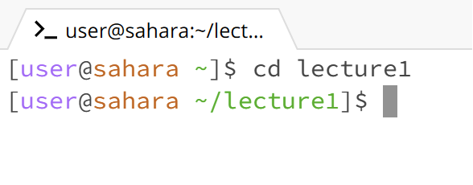
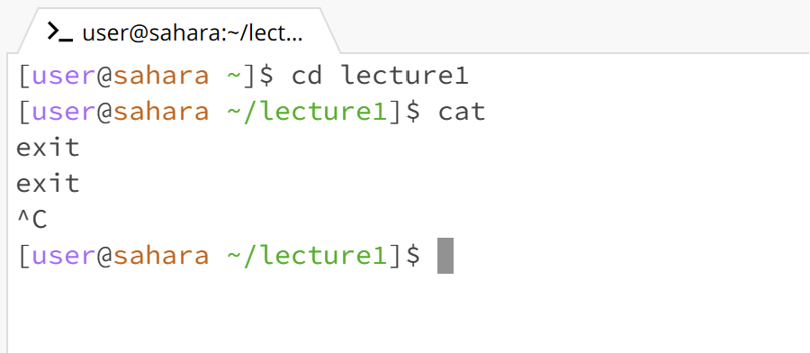
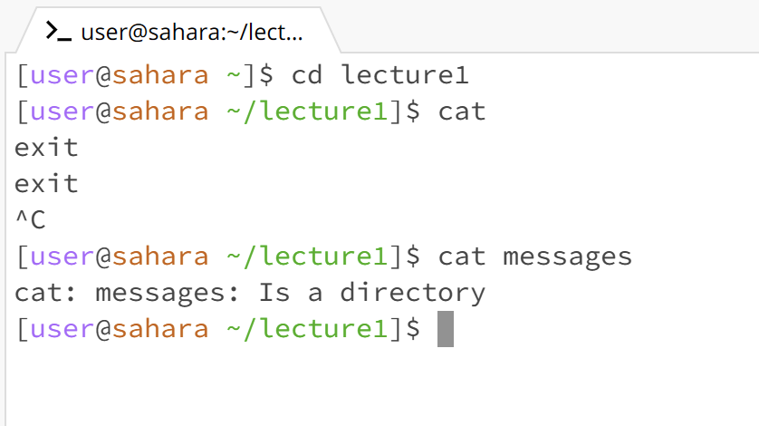
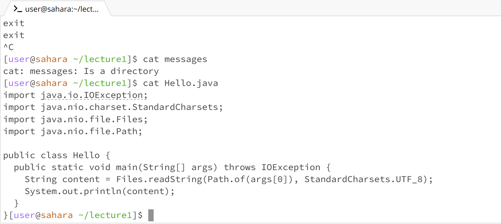

# Lab Report 1 
## `Command cd`
**1. Working Directory:** `/home` \
When the command `cd` is used with no arguments, nothing is printed and nothing happens.\
*Not an Error*\

**2. Working Directory:** `/home` \
When the command `cd` is used with a directory as an argument, nothing is printed however the path(working directory) changes from `/home` to `/home/lecture1`.\
*Not an Error*\

**3. Working Directory:** `/home/lecture1` \
When the command `cd` is used with a path/file as an argument, an error is printed as command cd is used with directories (to enter or exit them) not files.\
*Error*\
 

## `Command ls`
**1. Working Directory:** `/home/lecture1` \
When the command `ls` is used with no arguments, it prints the files and folders in the working directory.\
*Not an Error*\

**2. Working Directory:** `/home/lecture1` \
When the command `ls` is used with a directory as an argument, it prints the files and folders in the directory(written as the argument).\
*Not an Error*\

**3. Working Directory:** `/home/lecture1` \
When the command `ls` is used with a path/file as an argument, it prints the name of the file.\
*Not an Error*\

## `Command cat`
**1. Working Directory:** `/home/lecture1` \
When the command `cat` is used with no arguments, nothing happens till you type something(input) which is reprinted in the next line. It does not stop running till `Ctrl + C` is pressed.\
*Not an Error*\

**2. Working Directory:** `/home/lecture1` \
When the command `cat` is used with a directory as an argument, it dispays an error saying that the command line argument is a directory as cat can only print contents in a file..\
*Error*\

**3. Working Directory:** `/home/lecture1` \
When the command `cat` is used with a path/file as an argument, it prints the contents in the file.\
*Not an Error*\

